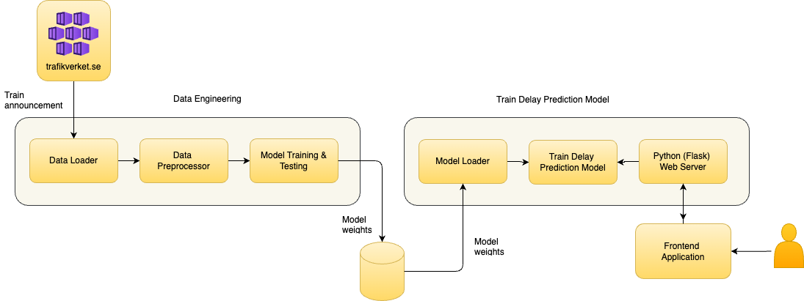
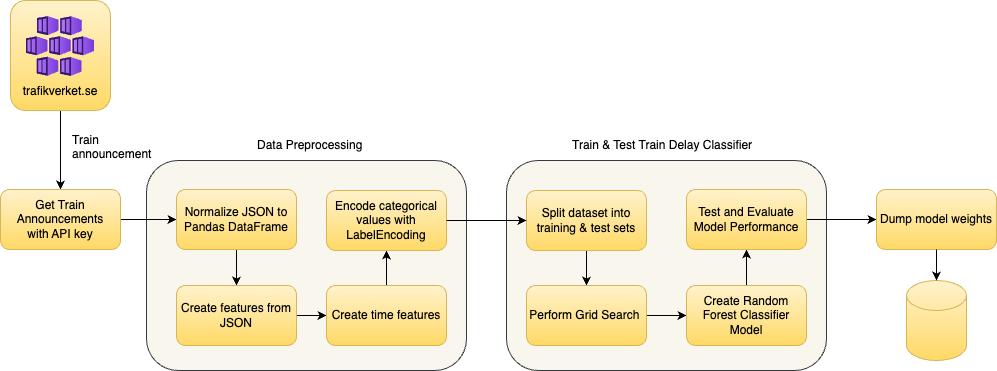
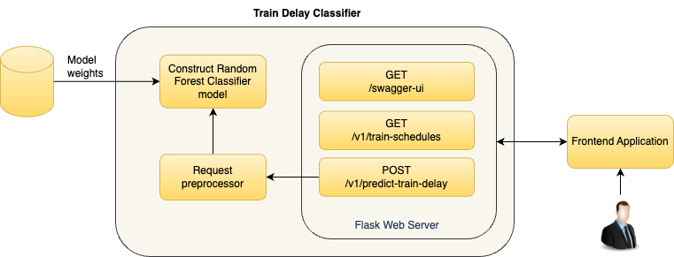

# Train Delay Prediction System
Project for Machine Learning Engineering Course: BTH

### High-level Architecture Diagram

### Data Engineering Diagram

### Train Delay Prediction Model Architecture Diagram

### Run backend service
$ env FLASK_APP=app.py python -m flask run

